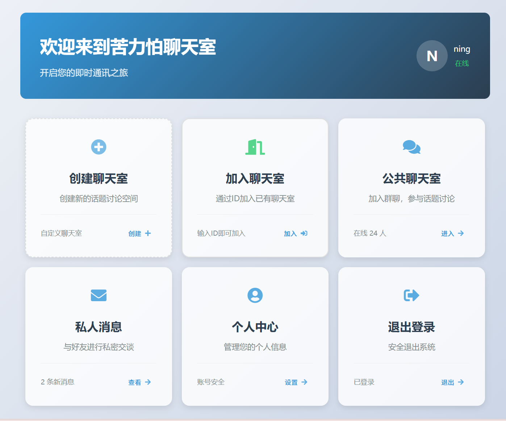

# WebServer


一个基于C++11的高性能网络服务器，支持HTTP/1.1协议和WebSocket协议，提供静态文件服务和API接口。

## 主要功能

- ✅ HTTP/1.1协议支持
- ✅ WebSocket全双工通信
- ✅ 静态文件服务（HTML/CSS/JS）
- ✅ 用户认证系统（登录/注册/注销）
- ✅ MySQL连接池管理
- ✅ 多线程并发处理
- ✅ 请求缓存控制
- ✅ 信号安全退出
- ✅ 集成性能测试工具（WebBench）

## 技术特点

1. **高性能架构**
   - Reactor事件驱动模型
   - 多线程 + 线程池设计
   - Epoll边缘触发优化
   - 非阻塞I/O操作

2. **安全可靠**
   - MySQL连接池自动回收
   - Cookie-based会话管理
   - 请求报文完整性校验
   - 优雅退出信号处理

3. **易扩展性**
   - 模块化设计（TCP/HTTP/WebSocket分离）
   - 支持自定义路由处理
   - 配置驱动部署（JSON配置支持）

## 快速部署

```bash
# 1. 编译项目
make

# 2. 运行HTTP服务器（端口8888）
./server

# 3. 运行WebSocket服务器（端口9999）
./WS_Server
```
## MySQL数据库配置
在`config.json`文件中配置MySQL数据库连接信息：
````json
{
    "host": "localhost",
    "user": "webuser",
    "password": "securepass",
    "database": "webdb",
    "poolSize": 8,
    "timeout": 5
}
```
## 数据库表结构
````sql
-- auto-generated definition
create table messages
(
    id         bigint auto_increment comment '消息ID，自增主键'
        primary key,
    room_id    bigint                              not null comment '关联的聊天室ID',
    user_id    bigint                              not null comment '发送消息的用户ID',
    content    text                                not null comment '消息内容',
    timestamp text                                 null comment '消息发送时间',
    constraint messages_ibfk_1
        foreign key (room_id) references rooms (id),
    constraint messages_ibfk_2
        foreign key (user_id) references users (id)
)
    comment '聊天消息表';

create index idx_room
    on messages (room_id)
    comment '聊天室索引，用于快速查找某个聊天室的消息';

create index user_id
    on messages (user_id);

-- auto-generated definition
create table chatroom_members
(
    id          bigint auto_increment comment '主键ID'
        primary key,
    chatroom_id bigint not null comment '聊天室ID',
    user_id     bigint not null comment '用户ID',
    constraint uk_chatroom_user
        unique (chatroom_id, user_id),
    constraint fk_member_chatroom
        foreign key (chatroom_id) references rooms (id)
            on delete cascade,
    constraint fk_member_user
        foreign key (user_id) references users (id)
            on delete cascade
)
    comment '聊天室成员表';

-- auto-generated definition
create table rooms
(
    id         bigint auto_increment comment '聊天室ID，自增主键'
        primary key,
    name       varchar(100)                        not null comment '聊天室名称',
    created_at timestamp default CURRENT_TIMESTAMP null comment '聊天室创建时间'
)
    comment '聊天室信息表';

-- auto-generated definition
create table users
(
    id         bigint auto_increment comment '用户ID，自增主键'
        primary key,
    username   varchar(50)                         not null comment '用户名，唯一',
    email      varchar(100)                        not null comment '邮箱地址，唯一',
    created_at timestamp default CURRENT_TIMESTAMP null comment '用户创建时间',
    password   varchar(20)                         not null comment '密码',
    constraint email
        unique (email),
    constraint name
        unique (username)
)
    comment '用户信息表';

create index idx_name
    on users (username)
    comment '用户名索引，用于快速查找用户';


````

## 在线聊天室
实现了一个简单的在线聊天室，支持多用户实时聊天，目前只支持群聊，注册账号，登录账号。

后续开发功能：
- 创建群聊
- 加入群聊
- 退出群聊
- 私聊
